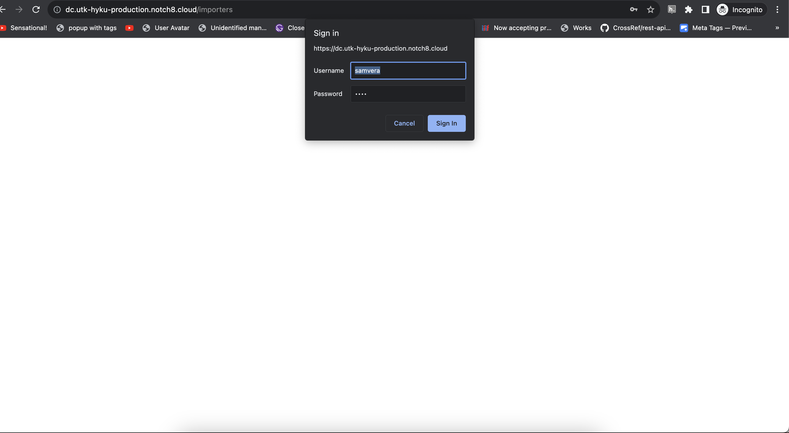
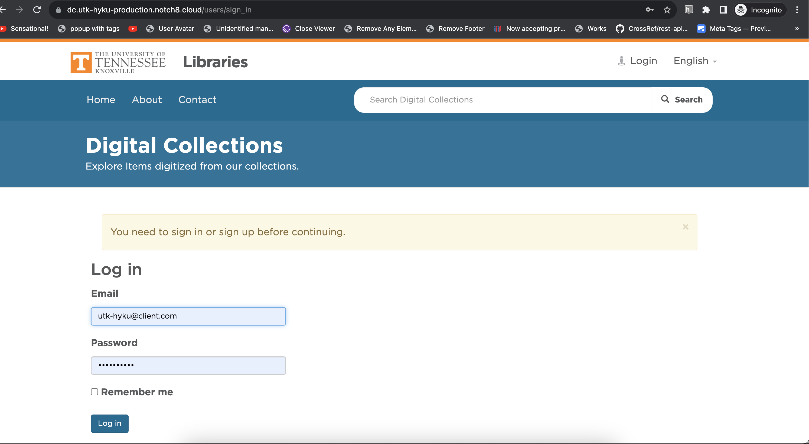
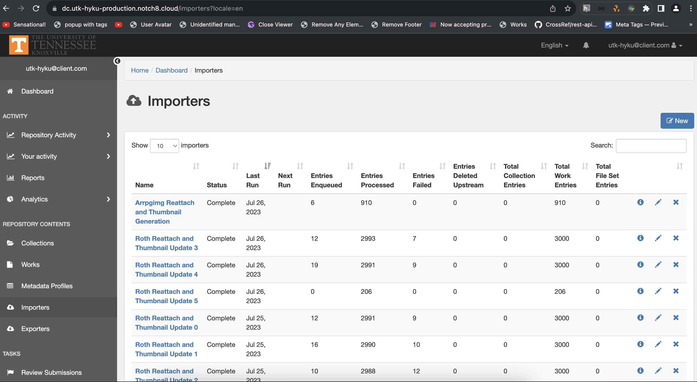
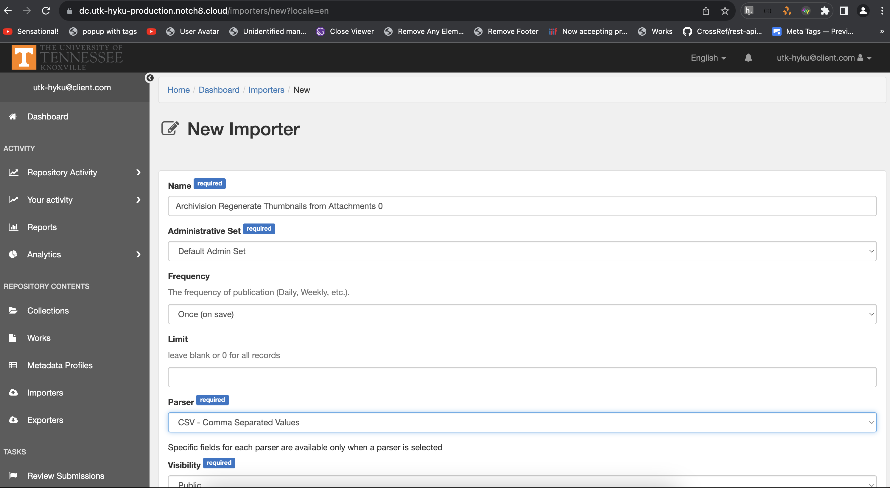
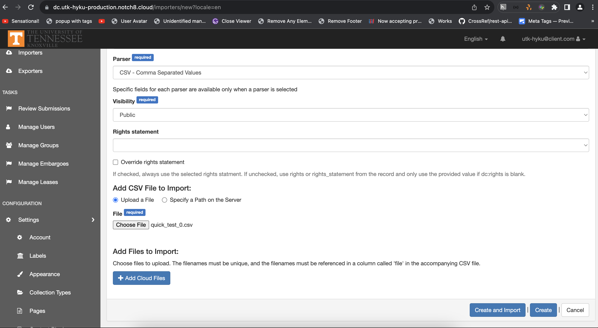

The Importer Dashboard
======================

About
-----

This describes the Import dashboard and how to submit a new import.

Adding an Import
----------------

To upload a new import, you need to begin at the `Import Dashboard <https://dc.utk-hyku-production.notch8.cloud/importers?locale=en>`_.

To access this page, you will first need to login to the repository.

Then, you will need to login to the admin dashboard.

Once you are logged in, you will be able to access the Import Dashboard.

To create a new import, click the "New" button.

Next, you will need to give the import a name and select the type of import.

Finally, attach the CSV file to the import.

