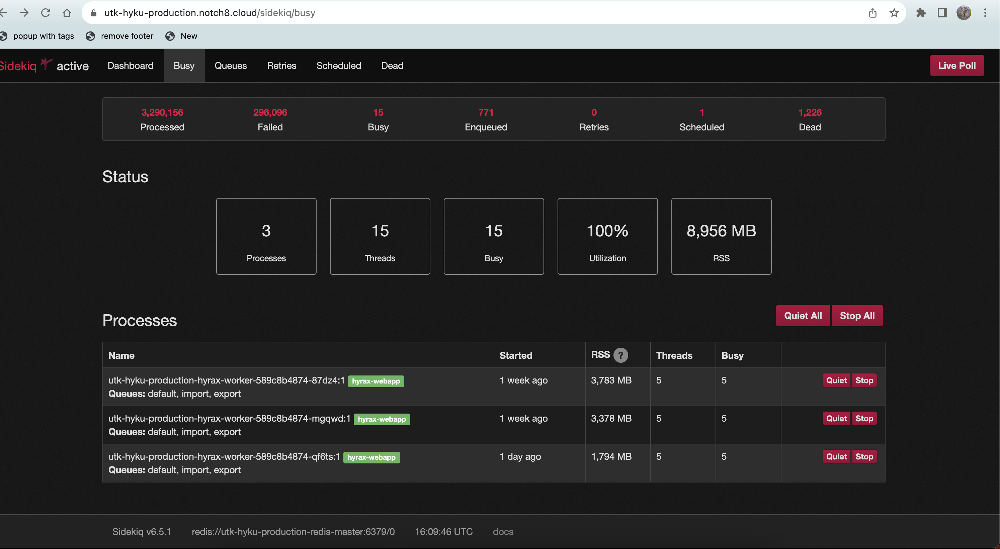

Monitoring Sidekiq
==================

About
-----

`SideKiq <https://utk-hyku-production.notch8.cloud/sidekiq/busy>`_ is the tool we use for task management.  It helps us
understand when the repository is busy or has problems.

Monitoring an Import Job
------------------------

To monitor `SideKiq <https://utk-hyku-production.notch8.cloud/sidekiq/busy>`_ , you will need to first login with your
repository authentication.

.. image:: ../images/login.png
   :width: 100%
   :alt: Repository Login

Once you have logged in, you will be taken to the SideKiq dashboard.  This dashboard will show you the current status.

Before you start a new job, ensure that these things are all true:

1. The :code:`Busy` tab says 0 instead of 15 like in the image below.
2. The :code:`Enqueued` tab says 0.
3. The :code:`Scheduled` tab says 0.
4. The :code:`Retries` tab says 0.

If any of these are not true, you will need to wait for the current jobs to finish before starting a new one.

Also, just because it looks like it's about to be 0 isn't necessarily the case.  Therefore don't start a new job until
you are sure the previous job is complete.
