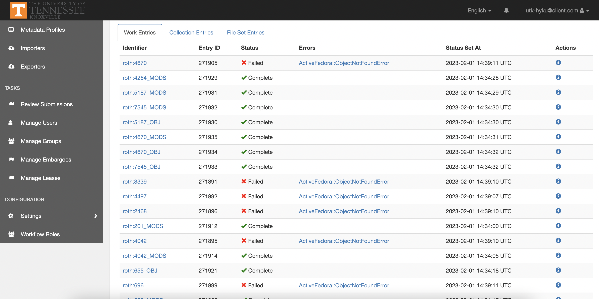

Troubleshooting Imports
#######################

Silent Failures
===============

Sometimes, Bulkrax imports will fail silently.  When this happens, the import page may show 0 errors but reviewing or
crawling the pages of importers will show errors like: :code:`ActiveFedora::ObjectNotFoundError` or :code:`LDP::HTTPError:`.

Normally, this failure happens with works (not FileSets). When it does, several steps are required in order to correct
the ingestion.  Whatever you may hear from a vendor, never attempt to fix these errors by retrying your import.  If you
do this, the problem will get worse.  The failure messages will shift to "Completed." Instead, you should reimport the
errored works. To do this, you need to attempt to delete the failed works. To do this, see deleting filesets and works.
When you do your initial delete, the work will not actually be deleted. A better method is:

1. delete affected works
2. attempt to reattach attachments to those works
3. delete the affected works again
4. finally, reattach attachments.

It may be that the last delete may require the delete to be "metadata and filesets," but this has not been confirmed. If
you do this, you may see that the attachments may get a thumbnail regenerated for them from the fileset even though you
are not working on the filesets directly and should not be.

Failed FileSets
===============

Crawling for Problems
=====================
